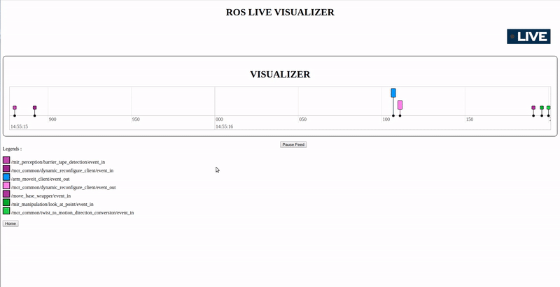

[](http://badges.mit-license.org)
[](https://travis-ci.org/agrija9/Software-Development-Project)

# Post-mortem/Live Analysis of a ROS Bag File

This tool plots the topics of a RosBag file as a timeline. The timeline graph runs as an interactive web application that allows to select topics at ease and shows their corresponding messages and timestamps.

<p align="center">
  <br><br>
  
  <b>This is the look of the Live Visualizer</b>
  <br><br>
  
  <b>This shows the filtering of rostopics in the graph</b>
</p>


## Prerequisites

Software needed to run this repository:

- [Ubuntu 16.04](https://ubuntu.com/download/desktop)
- Python 2.7 / 3.6

## Installation

**Note 1:** If you have a default Anaconda environment sourced when opening a terminal, you must deactivate it by doing ```conda deactivate``` in terminal. 

**Note 2:** To use this application you **must** install ROS in your system. 

### ROS

Follow the steps from 1 to 1.7 in this tutorial to install [ROS Kinetic](http://wiki.ros.org/kinetic/Installation/Ubuntu) in Ubuntu 16.04.

### Python virtual environment

Open terminal to install pip and virtual environment

```
python3 -m pip install --user --upgrade pip
python3 -m pip install --user virtualenv (outdated)
sudo apt-get install python3-venv
```

### Clone repository and install requirements

Clone this repository in your computer

```
git clone https://github.com/agrija9/Software-Development-Project.git
```

Create a python environment in main folder

```
cd Rosbag-Analyser/
python3 -m venv env
```

This will create a folder called ```env``` where all the packages required to run this software will be stored.

Now activate python environment 

```
source env/bin/activate
```

Install requirements in python environment

```
pip install -r requirements.txt
```

## Run

Open a terminal and do

```
ros (outdated)
roscore
```

In another terminal do

```
cd Software-Development-Project/
source env/bin/activate
cd src/
python3 app.py
```

After this, you should see a message in terminal saying ```Failed to load Python extension for LZ4 support. LZ4 compression will not be available.```. This means that the application is running properly. 

A local host has been created at ```http://127.0.0.1:5000/```. Go to that page in your browser and start using the application.


## Test

For unit testing run

```
python3 test_app.py
```

## Built With

* [Flask](https://www.palletsprojects.com/p/flask/) - Web framework
* [visjs](https://visjs.org/) - Interactive timeline in browser

##  Authors 

- [Alan Preciado Grijalva](https://github.com/agrija9)
- [Ragith Ayyappan Kutty](https://github.com/rkutty1)
- [Devaiah Ulliyada Arun](https://github.com/divindevaiah)
- [Shravanthi Arvind Patil](https://github.com/ShravanthiPatil)

## License

- **[MIT license](http://opensource.org/licenses/mit-license.php)**

## Contributions

- PEP 8
